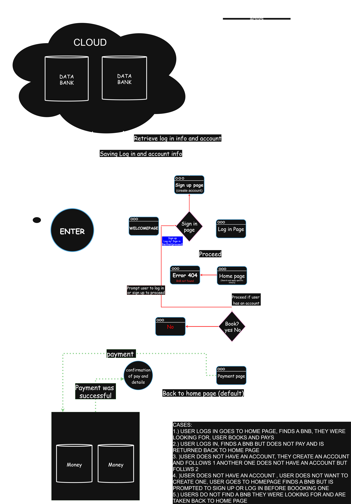

# Requirement Analysis in Software Development.
## Project Description
The Requirement Analysis Project focuses on crafting a comprehensive foundation for software development by documenting, analyzing, and structuring requirements. It aims at creating a blueprint of the requirement analysis phase for a booking management system. This project simulates a real-world development scenario, emphasizing clarity, precision, and structure in defining requirements to set the stage for successful project execution.
### Learning Objective
The objective of this project is to enhance a professional developer’s ability to:
- Master the principles and methodologies of Requirement Analysis in the software development lifecycle (SDLC).
- Efficiently translate project needs into structured documentation.
- Identify and categorize functional and non-functional requirements for scalable systems.
- Leverage tools like Draw.io for visual representation of system requirements.
- Establish clear acceptance criteria to ensure alignment with business and user goals.
- Apply best practices to produce industry-standard documentation and diagrams.
## What is Requirement Analysis?
Requirement Analysis is the process of identifying, gathering, documenting, and analyzing the needs and expectations of stakeholders for a software system. It ensures that the development team clearly understands what is to be built, why it is needed, and how it should function.

## Why is Requirement Analysis Important?
Requirement Analysis plays a foundational role in the Software Development Lifecycle (SDLC). Its importance can be summarized as follows:

1. Defines Project Scope
Clearly identifies what the software should and should not do.
Prevents scope creep by establishing boundaries early on.
2. Bridges Stakeholders and Developers
Translates business needs into technical specifications.
Ensures developers understand the business context, not just the code.
3. Reduces Risks and Costs
Detects potential issues early in the process.
Fixing errors during requirement analysis is significantly cheaper than fixing them during coding or after deployment.
4. Improves Product Quality
Aligns the final product with user needs and business goals.
Leads to better user satisfaction through usability-focused requirements.
5. Guides Design and Development
Serves as a blueprint for the design, architecture, and coding stages.
Provides measurable acceptance criteria that define “done.”
6. Supports Testing and Validation
Requirements act as the foundation for test case creation.
Ensures that every feature developed can be tested against documented expectations.
7. Facilitates Communication
Provides a single reference point for stakeholders, project managers, and developers.
Minimizes misunderstandings and misaligned expectations.

## Key Activities in Requirement Analysis
- Requirement Gathering: Collecting input from clients, users, and stakeholders.
- Requirement Documentation: Structuring requirements into understandable formats (e.g., Software Requirement Specification (SRS)).
- Requirement Validation: Ensuring requirements are correct, complete, feasible, and aligned with business goals.
- Requirement Elicitation: The process of gathering requirements from stakeholders through techniques like interviews, surveys, and observation.
- Requirement Validation: The process of ensuring that gathered requirements are accurate, complete, feasible, and aligned with business goals.
## Types of Requirements

### Functional Requirements
Functional requirements describe **what the system should do** — the specific features, tasks, and interactions that fulfill the project goals.  
These are directly tied to the user’s needs and the system’s core functionalities.  

**Examples for Booking Management System:**
- Users must be able to create an account and log in.
- System should allow users to search for available BnBs using filters (location, price, amenities, dates).
- Users should be able to view detailed property information (images, description, reviews).
- System should allow users to book a property and proceed to checkout.
- Payment must be processed securely via an external payment gateway.
- Users should receive booking confirmation notifications (on-site and via email).

### Non-Functional Requirements
Non-functional requirements describe **how the system should perform**. They focus on the quality, performance, and constraints of the system, ensuring reliability and a positive user experience.  

**Examples for Booking Management System:**
- The booking system should load search results within **2 seconds**.
- The system must handle at least **500 concurrent users** without crashing.
- Sensitive data (passwords, payments) must be encrypted using SSL/TLS.
- The platform should be available **99.9% uptime** annually.
- The system must be mobile-responsive and work across all major browsers.
- Confirmation emails should be delivered to the user within **5 minutes** after booking.

## Use Case Diagrams
***Use Case Diagrams*** are visual representations in UML (Unified Modeling Language) that show the interactions between actors (users or external systems) and a system to achieve specific goals (use cases). They focus on what the system should do rather than how it is implemented.

### Benefits of Use Case Diagrams
- Clarity: Provide a simple, high-level view of system functionality.
- Communication: Bridge the gap between technical teams and non-technical stakeholders.
- Requirement Capture: Help identify functional requirements and system boundaries.
- Prioritization: Make it easier to see which features are most critical to users.
- Documentation: Serve as part of the requirement specification for future reference.
- Validation: Ensure that all user interactions and goals are considered during analysis.

### Cases
1. User with an account → Books and Pays

***User logs in → navigates to homepage → searches for a BnB → finds desired BnB → books and completes payment successfully.***

2. User with an account → Does Not Pay

***User logs in → searches for a BnB → finds desired BnB → attempts booking but does not pay → system returns user to homepage.***

3. New User → Account Creation Path

***User does not have an account → creates a new account → logs in → follows flow of Case 1 (books and pays) OR follows flow of Case 2 (does not pay).***

4. Guest User → Must Sign Up/Log In Before Booking

***User does not have an account → chooses not to create one → navigates homepage and finds a BnB → system prompts sign-up/log-in before allowing booking.***

5. User Cannot Find Desired BnB

***User logs in (or browses homepage) → searches for a BnB → no suitable results → system returns user to homepage.***
### actors
- Users
- System admin managers
- external systems eg: payment gateway for transaction and confirmation
- external stystems 2 eg: cloud back up for data storage
## Acceptance Criteria
Acceptance criteria are the predefined conditions that a software product or feature must meet to be considered complete and acceptable by stakeholders. They ensure that requirements are clear, testable, and measurable, bridging the gap between business needs and technical implementation.

***Importance:***

- Provide clarity on what the system should do.
- Help in avoiding misunderstandings between stakeholders, developers, and testers.
- Form the basis for test cases and quality assurance.
- Allow teams to determine the “done” status of a feature.
- Ensure the system meets user expectations and business goals.

### Example: Acceptance Criteria for Checkout Feature

Feature: Checkout in the Booking Management System

***Acceptance Criteria:***

- User must be logged in to proceed with checkout.
- System must display the booking summary (property details, price, dates).
- User can select a payment method (credit card, mobile money, PayPal, etc.).
- System must securely process the payment via an external payment gateway.
- A booking confirmation page must be shown upon successful payment.
- User must receive an email confirmation within 5 minutes.
- If payment fails, user must see an error message and retry option.
